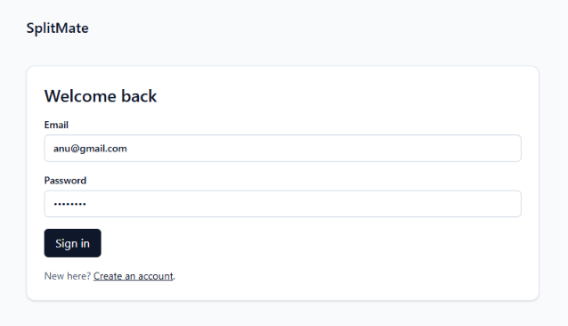
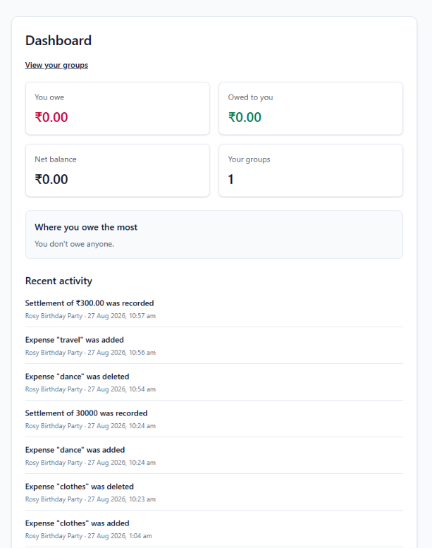
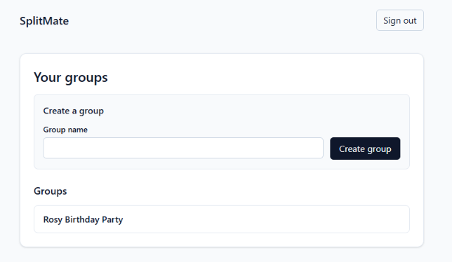
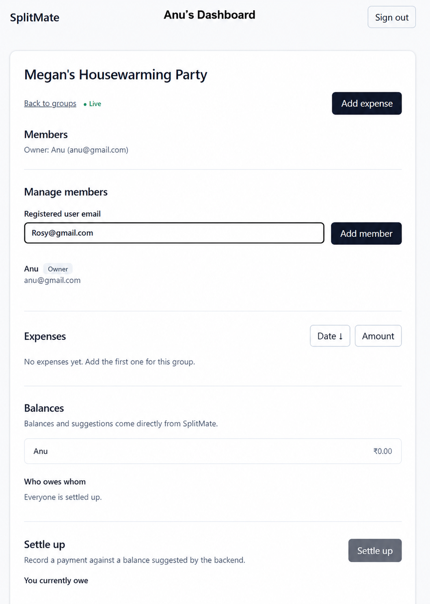
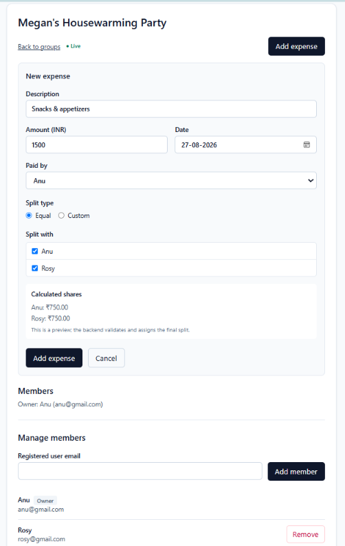
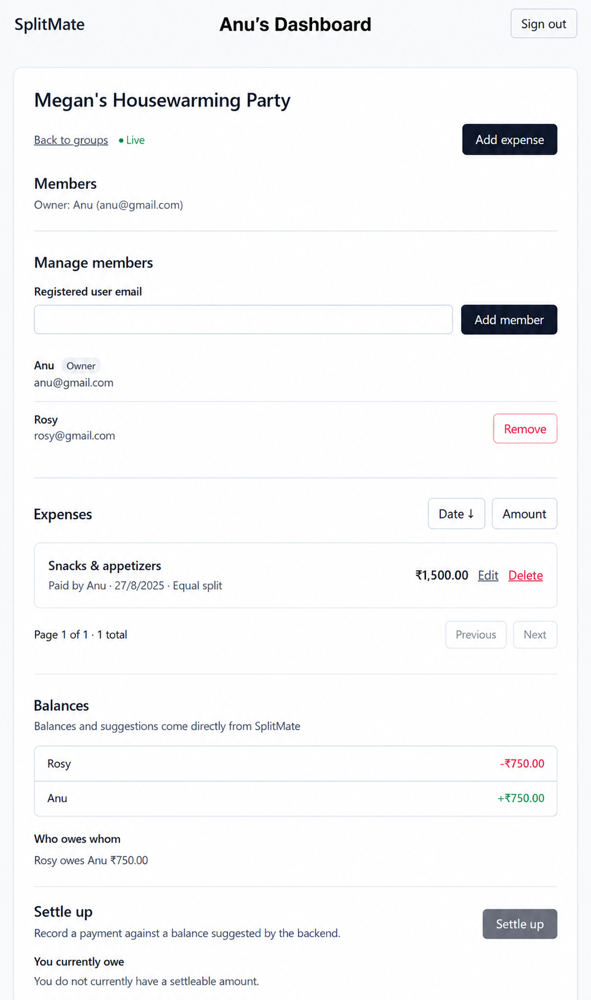
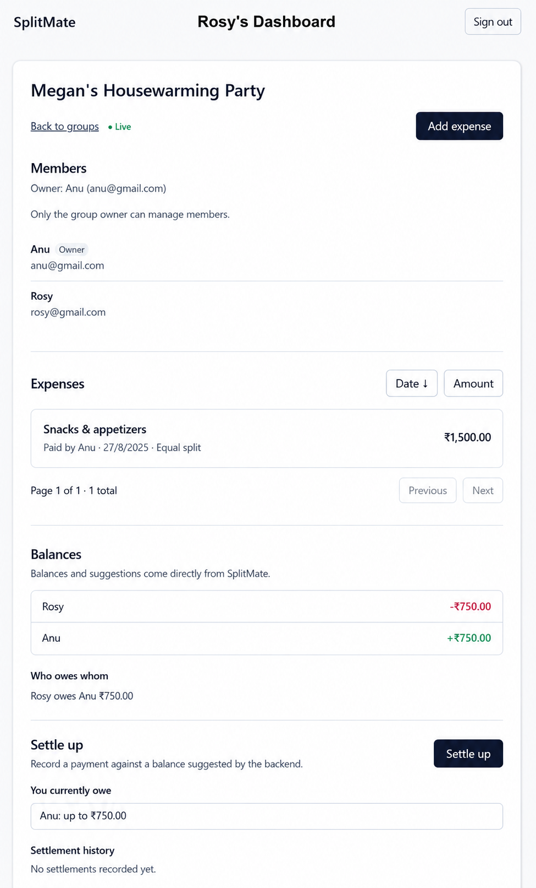
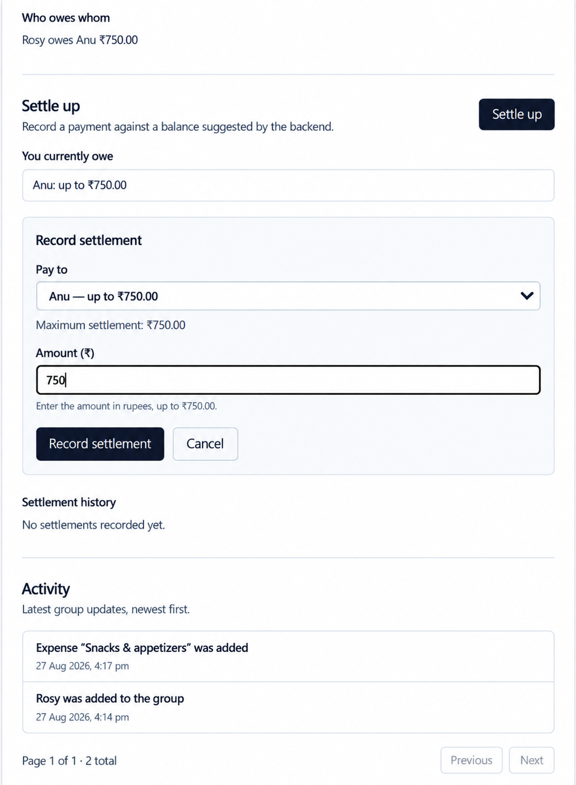

# 💸 SplitMate

### Smart group expense tracking, simplified.

A full-stack expense-sharing app built with **React, FastAPI, PostgreSQL, and WebSockets**.

Create groups, split expenses, track balances, settle payments, and see changes update in real time.

<p align="center">
  <a href="#-features">Features</a> •
  <a href="#-tech-stack">Tech Stack</a> •
  <a href="#-getting-started">Setup</a> •
  <a href="#-demo-data">Demo</a> •
  <a href="#-screenshots">Screenshots</a>
</p>

---

## 🚀 Features

|    | Feature                                  |   |
| -- | ---------------------------------------- | - |
| 🔐 | Registration, login & JWT authentication | ✅ |
| ♻️ | Rotating refresh tokens                  | ✅ |
| 👥 | Groups & member management               | ✅ |
| 💰 | Create, edit & delete expenses           | ✅ |
| ➗  | Equal & custom splits                    | ✅ |
| 📊 | Balances & debt suggestions              | ✅ |
| 💳 | Settlements & history                    | ✅ |
| 📝 | Group activity feed                      | ✅ |
| ⚡  | Real-time WebSocket updates              | ✅ |
| 📈 | Personal dashboard                       | ✅ |
| 🌱 | Repeatable demo seed data                | ✅ |
| 💵 | Exact money handling                     | ✅ |

---

## 🧰 Tech Stack

**Frontend**
React · Vite · React Router · Axios · Tailwind CSS

**Backend**
FastAPI · SQLAlchemy · Alembic · PostgreSQL · WebSockets · JWT

**Development & Testing**
Docker Compose · Pytest · Git/GitHub

---

## 🏗️ Architecture

```text
┌─────────────────────────────────────┐
│             React UI                │
│ Dashboard • Groups • Expenses       │
│ Balances • Settlements • Activity   │
└──────────────────┬──────────────────┘
                   │
          REST / Axios + WebSocket
                   │
                   ▼
┌─────────────────────────────────────┐
│           FastAPI Backend            │
│ Auth • Expenses • Balances          │
│ Settlements • Activity • Realtime   │
└──────────────────┬──────────────────┘
                   │
                   ▼
┌─────────────────────────────────────┐
│              PostgreSQL             │
│ Users • Groups • Expenses           │
│ Splits • Settlements • Activity     │
└─────────────────────────────────────┘
```

The backend is authoritative for **authorization and financial calculations**. WebSocket events act as invalidation signals; the frontend refetches authoritative REST state.

---

## 📁 Project Structure

```text
SplitMate/
├── backend/
│   ├── app/
│   ├── alembic/
│   ├── scripts/
│   ├── tests/
│   └── README.md
├── frontend/
│   ├── src/
│   └── package.json
├── docs/
│   └── screenshots/
├── docker-compose.yml
├── .gitignore
└── README.md
```

---

## 🎯 Core Flow

```text
Login
  ↓
Dashboard
  ↓
Groups
  ↓
Group Detail
  ├── Expenses
  ├── Balances
  ├── Settlements
  └── Activity
        ↓
   Live WebSocket Updates
```

---

## 💵 Money Handling

Users and APIs work with **rupees**; internal calculations and PostgreSQL use **integer paise**.

```text
₹250.00 → 25000 paise
₹250.50 → 25050 paise
```

The backend uses Python `Decimal` for exact conversion and avoids floating-point money calculations.

### Equal Split Rounding

```text
₹100 ÷ 3

₹34
₹33
₹33
```

The extra smallest unit is assigned according to request order, and the total always matches the original expense.

---

## 🔐 Authentication

SplitMate uses a short-lived JWT access token and an opaque refresh token.

* Access token: **15 minutes**
* Refresh token: **7 days** by default
* Refresh tokens are rotated on refresh
* PostgreSQL stores only the **SHA-256 hash**
* Revoked/expired refresh tokens cannot be reused

Frontend:

* access token → memory
* refresh token → `sessionStorage`
* Axios attaches access tokens
* concurrent `401` responses share one refresh operation
* failed refresh clears auth state and redirects to login

---

## ⚡ WebSockets

Group updates use:

```text
WS /ws/groups/{groupId}?token=<accessToken>
```

Supported events:

```text
expense_added
expense_edited
expense_deleted
settlement_recorded
activity_added
balances_updated
overall_balance_updated
```

Connections are authenticated and group-scoped, reconnect with exponential backoff, and use the latest access token after refresh.

After reconnecting, REST data is refetched because missed events are not replayed.

---

## 📊 Groups, Expenses & Balances

### Groups

* Create and view groups
* Add registered members by email
* Remove members when permitted

### Expenses

* Equal and custom splits
* Edit/delete
* Pagination
* Sorting
* Exact split validation

### Balances

* Member net balances
* Who-owes-whom suggestions
* Settlement relationships
* Settlement history

### Dashboard

* Total you owe
* Total owed to you
* Net balance
* Group count
* Largest debt group
* Recent activity

---

## 📝 Activity Feed

The activity feed tracks:

* member additions
* expense creation
* expense edits
* expense deletion
* settlements

It supports loading, empty, error, and retry states and updates through WebSockets without requiring a refresh.

---

## 🌱 Demo Data

Run from `backend`:

```powershell
python -m scripts.seed_demo
```

### Demo Accounts

| Name | Email                 | Password            |
| ---- | --------------------- | ------------------- |
| Rosy | `rosy@splitmate.demo` | `SplitMateDemo123!` |
| Anu  | `anu@splitmate.demo`  | `SplitMateDemo123!` |

### Demo Group

**Rosy Birthday Party**

Seeded data includes:

* Venue deposit — ₹3,000
* Decorations — ₹1,200
* Cake — ₹900
* Settlement — ₹500 from Anu → Rosy

Expected remaining balance:

```text
Anu owes Rosy ₹700.00
```

The seed is repeatable and avoids duplicates.

---

## 🏃 Getting Started

### Prerequisites

* Docker Desktop
* Python
* Node.js + npm

### 1. Start PostgreSQL

```powershell
docker compose up -d
docker compose ps
```

### 2. Start the Backend

```powershell
cd backend
.\venv\Scripts\Activate.ps1
$env:PYTHONPATH="C:\Users\ANUSHKA\Desktop\SplitMate\backend"
uvicorn app.main:app --host 127.0.0.1 --port 8000
```

API: `http://127.0.0.1:8000`
Swagger: `http://127.0.0.1:8000/docs`

### 3. Start the Frontend

```powershell
cd frontend
npm install
npm run dev
```

Use the `Local:` URL printed by Vite.

### 4. Seed Demo Data

```powershell
cd backend
python -m scripts.seed_demo
```

---

## 🧪 Testing

### Backend

```powershell
cd backend
.\venv\Scripts\Activate.ps1
$env:PYTHONPATH="C:\Users\ANUSHKA\Desktop\SplitMate\backend"
pytest tests -q
```

### Frontend

```powershell
cd frontend
npm run build
```

Current verified backend suite:

```text
116 passed
```

---

## 🔌 API Overview

```text
POST /auth/register
POST /auth/login
POST /auth/refresh
POST /auth/logout

GET  /dashboard

POST /groups
GET  /groups
GET  /groups/{groupId}

POST /groups/{groupId}/members
DELETE /groups/{groupId}/members/{userId}

POST /groups/{groupId}/expenses
GET  /groups/{groupId}/expenses
PUT  /expenses/{expenseId}
DELETE /expenses/{expenseId}

GET /groups/{groupId}/balances

POST /groups/{groupId}/settlements
GET  /groups/{groupId}/settlements

GET /groups/{groupId}/activity

WS /ws/groups/{groupId}
```

Full API contract: `http://127.0.0.1:8000/docs`

---

## 🖼️ Screenshots

| 1                                                                 | 2                                                                 | 3                                                                 | 4                                                                 |
| ----------------------------------------------------------------- | ----------------------------------------------------------------- | ----------------------------------------------------------------- | ----------------------------------------------------------------- |
|  |  |  |  |

| 5                                                                 | 6                                                                 | 7                                                                 | 8                                                                 |
| ----------------------------------------------------------------- | ----------------------------------------------------------------- | ----------------------------------------------------------------- | ----------------------------------------------------------------- |
|  |  |  |  |

---

## ⚠️ Known Limitations

* WebSocket events are not replayable.
* Missed updates are recovered through REST refetching after reconnect.
* The project is intended for local development/demo use.
* Production deployment, HTTPS, secret management, observability, and CI/CD are outside the current scope.

---

## 🎬 Demo Flow

```text
Login
  ↓
Dashboard
  ↓
Rosy Birthday Party
  ↓
Members
  ↓
Expenses
  ↓
Balances
  ↓
Settlement
  ↓
Activity
  ↓
Second user/session
  ↓
Live update without refresh
```

---

## 📌 Project Status

### ✅ Feature-complete development build

Core authentication, groups, expenses, balances, settlements, activity tracking, WebSockets, dashboard, exact money handling, and demo seed data are implemented and verified.

---

<p align="center">
  <b>💸 SplitMate</b><br>
  <sub>Track expenses. Split fairly. Settle easily.</sub>
</p>
